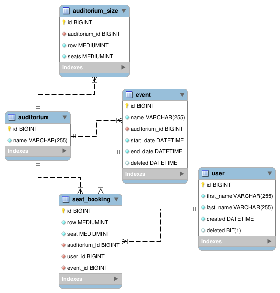

# Booking System 

Sandbox booking system project

## ER Diagram



## API Documentation


### 1. Create Auditorium

**Endpoint:** `/api/v1/audiotorium`  
**Method:** `POST`

**Request Body:**

```json
{
  "name": "Main Hall",
  "seatsPerRow": [10, 15, 20]
}
```

**Response Body:**

```json
[
  {
    "id": 1,
    "auditoriumId": 1,
    "row": 1,
    "seats": 10
  },
  {
    "id": 2,
    "auditoriumId": 1,
    "row": 2,
    "seats": 15
  },
  {
    "id": 3,
    "auditoriumId": 1,
    "row": 3,
    "seats": 20
  }
]
```


### 2. Create Event

**Endpoint:** `/api/v1/event`  
**Method:** `POST`

**Request Body:**

```json
{
  "id": 1,
  "name": "Concert",
  "auditoriumId": 2,
  "startDate": "2024-09-30T18:00:00Z",
  "endDate": "2024-09-30T21:00:00Z",
  "deleted": null
}
```